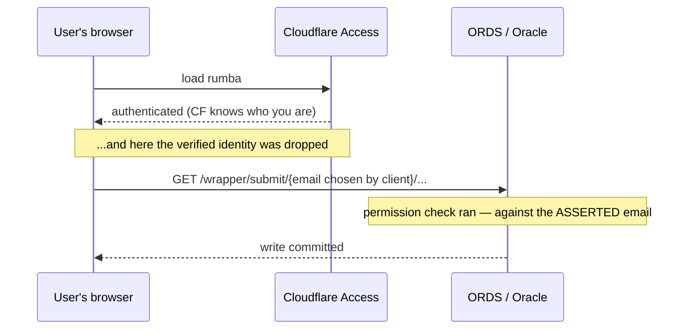

# VEO-78 Gateway Worker — an explainer

> ## `[TICKET CLOSED 2026-08-11]` — read this as background, not as a live decision aid
>
> **Verified against Jira 2026-08-19 via Atlassian MCP** (*FR:Finn*). VEO-78 is `Closed`, archived by the PO on 2026-08-11 as obsolete in its current form. The abstraction idea was explicitly kept and returns under a **new ticket**, reframed against the VEO-140 menu-management line. A second premise also fell: *AR:Schliemann* refuted the ORDS-20.2-lacks-`:body` assumption on 2026-08-18.
>
> The explanatory content stands — the `aud`-versus-`iss` distinction, cookie-versus-header, and §6's confused-deputy problem are properties of the architecture, not of the ticket. **The decision this document was written to inform has already been made.**
>
> This document's own header warned *"this document will itself go stale — re-check the marked claims before acting on them."* It did, within eight days, and nobody re-checked, because the standing team record described VEO-78 as blocked on Atlassian access that in fact worked. **Writing the warning is not the same as building the check.**

**For:** Mihkel Putrinsh (the ticket's reporter) · **Written:** 2026-08-03 (*FR:Finn*)
**Subject:** [VEO-78](https://eestiraudtee.atlassian.net/browse/VEO-78) — *Gateway Worker — CF Worker vahekiht rumba ja ORDS vahel*
**Purpose:** comprehension, not decision. This is written to be read once and then argued with.
**Companion:** the actionability + team-fit assessment lives in [`veo-78-gateway-worker-assessment-2026-08-03.md`](veo-78-gateway-worker-assessment-2026-08-03.md). You do not need it to read this.

**Provenance convention.** Claims are marked **[verified]** when I read them in source, **[reported]** when they come from the ticket or another document and I could not check them. Source verification is against `Eesti-Raudtee/rumba` @ `main`, commit `5a5030e`, 2026-07-29, read 2026-08-03. That distinction earns its keep: an earlier draft of this document cited `evr-ui-kit` from a local clone that turned out to be six minor versions behind what rumba actually installs. **This document will itself go stale — re-check the marked claims before acting on them.**

---

## In five sentences

The ticket was written on 2026-06-01 against a rumba that no longer exists, and the single most important thing to know is that **the security hole it was created to close has already been closed** — by the ORDS/PL-SQL side deriving identity from the Cloudflare Access session, not by a Worker **[verified]**. So VEO-78 is no longer urgent, but it is not pointless either: with ORDS and Oracle scheduled for retirement on a one-to-three-year horizon, the Worker is the seam that turns that retirement from a rumba rewrite into a swap. What it has acquired instead is a genuine design problem — **interposing a Worker breaks the very mechanism that now makes the current setup safe** (§6), because a Worker has no user session and whatever it uses to get past CF Access changes who ORDS thinks is calling. The old open question still stands, now with source evidence behind it (§5). If you'd rather act than read, **§7 breaks the ticket into five separately-ownable pieces**, and the first thing to know is that the one formerly called "the security fix" is no longer fixing anything.

---

## 1. Why this task is relevant

### 1.1 Two states, and the ticket describes the older one

This section used to be simple: describe the hole, describe the fix. Source verification changed that, so it is now organised as a before and an after.

- **The PoC-era state** the ticket was written against (2026-05-29 PoC, ticket 2026-06-01) — §1.2. **This is history.** It is kept because it is what makes the current state legible: you cannot see why the current design is careful unless you know what it replaced.
- **The current state** on `main` — §1.3 **[verified]**.

If you only take one thing from §1: **the client-supplied-identity defect is gone, and a Worker is not what removed it.**

### 1.2 The PoC-era defect — *history, not current state*

The PoC endpoint had this shape **[reported — from the ticket]**:

```
GET /wrapper/submit/:email/:permission/:message
```

All three were **path segments supplied by whoever made the request**. The handler took `:email`, looked up that person's ELEMENDILUBA rights, and — if they checked out — wrote to Oracle.

The security property was counterintuitive and worth keeping in mind, because it is the thing the current design avoids: **the authorization check was sound; the authentication of the subject was absent.** ORDS faithfully verified that the named person was allowed to do the thing. It had no way to verify that the caller *was* the named person. The permission system worked perfectly and protected nothing, because the attacker picked the subject.

The exploit was editing one path segment:

```bash
# what your browser sends as you
curl 'https://<ords-host>/wrapper/submit/mihkel.putrinsh@evr.ee/SOME_PERM/some+message'

# what you send instead, five seconds later
curl 'https://<ords-host>/wrapper/submit/someone.else@evr.ee/SOME_PERM/some+message'
```

Two things set the blast radius. **Enumerability** — EVR addresses are `firstname.lastname@evr.ee`, so an attacker doesn't get *a* different identity, they *choose* one, namely whoever has the widest rights. And **it writes** — this was never information disclosure; it landed rows in Oracle attributed to someone who never made the request, damaging integrity and audit trail in the same event.

Scoped honestly, it was never internet-exploitable: ORDS sits behind Cloudflare, so an anonymous outsider couldn't reach it. The real shape was insider and lateral — any staff member with a browser, or any compromised staff account. Still a genuine access-control finding under NIS2 Art. 21(2)(d), and Ross Anderson's 2026-06-02 review of the sibling `rumba_sso_login` bridge rated exactly this trust model **HIGH**, calling it *"the single blocking item before production deployment."*

### 1.3 What is actually true now — and it is the good news **[verified]**

rumba no longer sends an identity to ORDS at all. There is **no email in any URL the client constructs** — I checked every one.

The menu pull, `apps/vjs/src/lib/api/menu.ts:34`:

```ts
const r = await fetch(apexBase + 'vjs_guard/rumba/menu', {
    credentials: 'include', redirect: 'manual', signal: controller.signal });
```

No parameters. Identity rides as the **Cloudflare Access cookie** — that is what `credentials: 'include'` is doing — and is derived **server-side** by the ORDS handler in the `vjs_db_vjs_guard` repo (`ords/rumba.sql`, cited at `apps/vjs/src/lib/config.ts:39`). The code says so directly (`menu.ts:24-26`): *"Identity is the Cloudflare Access email."* So does the app README: *"Menu is pulled from ORDS (`vjs_guard/rumba/menu`) **by Cloudflare Access identity**."*

The other two URL builders carry no identity either: `config.ts:41` appends a `?return_to=` (a URL, not a user), and `apex/url.ts:6-13` injects an Apex **session id** into `f?p=` fields. `/wrapper/submit` and `/wrapper/menu` do not appear in the client at all.

**So the defect in §1.2 has been fixed — on the PL/SQL side, exactly as Anderson's review suggested as its alternative** (validate at the ORDS/proxy layer rather than in the browser's URL). The payoff this document used to promise for VEO-78 — *"the email stops being an input"* — **already happened, and a Worker had nothing to do with it.** That sentence is the most important one in this rewrite.

Two limits on that claim, stated so you can push back. `/wrapper/submit` may still exist ORDS-side; I can only verify that **rumba does not call it** — the ORDS repo is a different codebase I did not read. And I verified `apps/vjs` specifically: `apps/home` and `apps/sample` contain no ORDS code at all, so this is a statement about the one app that talks to Apex.

### 1.4 So what does VEO-78 still buy?

Not the identity fix — that's banked. What remains is real but different in character:

**A migration path.** ORDS and Oracle are not in EVR's target stack; both are scheduled for obsolescence on a roughly one-to-three-year horizon **[reported]**. That makes protocol abstraction not insurance against a hypothetical but the seam for an event with a date:

- If rumba talks to ORDS directly, then when Oracle is retired, **rumba gets rewritten.**
- If rumba talks to a Worker, then when Oracle is retired, **the Worker's ORDS-facing half is swapped and rumba never notices.**

The instinct that "ORDS is going away, so why invest in it" is backwards. Nothing here is an investment *in* ORDS — the Worker is what makes ORDS cheap to remove. And the strangler-fig migration is visibly already running: `apps/vjs/src/routes/new-module/` is a live demo of a module rendered by rumba rather than the Apex iframe **[verified]**.

**A resilience boundary — and there is now direct evidence it's needed.** `menu.ts:22` declares `MENU_PULL_TIMEOUT_MS = 10_000` and drives it with an `AbortController` **[verified]**. That is a hand-rolled timeout, in the client, for one call. It is exactly the per-caller duplication ADR-013/APP-12 says should be standardised **once at the gateway** rather than re-implemented per caller. It works — but it is one call's worth of a policy that ought to be one layer's worth.

**And one thing it now has to avoid.** See §6: the mechanism that makes today's setup safe is precisely what a Worker interposes on.

### 1.5 The ticket's four reasons, re-graded against current state

| Reason the ticket gives | Grading now |
|---|---|
| **Identity validation** | **No longer the driver — already achieved by other means [verified].** This was the ticket's headline and the whole of §1.2. It is done. Re-doing it in a Worker would relocate the check, not add one. |
| **Protocol abstraction** | **Now the strongest.** The migration path for a scheduled retirement (§1.4), not a nice-to-have. |
| **Resilience boundary** | **Second, and evidenced.** `menu.ts:22`'s hand-rolled timeout is the concrete case for standardising at a gateway (§1.4). |
| **POST JSON body** | **Real but currently unexercised.** A `GET` that writes is a genuine correctness bug — GET is defined as safe and cacheable, so prefetchers and scanners can replay the write with no human, and free text in a path segment breaks on `/` or `#`. **Caveat: I cannot verify this against rumba, because rumba no longer calls a write endpoint.** It applies if and when a submit path is built through the gateway. |

So the ticket's own ordering has inverted: what it led with is finished, and what it listed last now carries it.

---

## 2. ADR-003 in detail

### 2.1 What it decides

**Cloudflare Access is the identity broker, and EVR does not build an auth server.** Concretely:

1. CF Access federates the actual identity providers — **Entra** for staff, **TARA** (the Estonian state auth service) for eID / external users.
2. **Apps do exactly one integration:** validate the `CF_Authorization` JWT — the ADR says validate **`aud`/`iss`** — and read identity from CF Access.
3. **Machine-to-machine** uses CF Access **service tokens** or mTLS, with secrets in Secret Server, never in code. *(Remember this line — it returns in §5 and §6.)*
4. **Do not build EVE.** The `authorization-server` repo is empty and stays a placeholder.
5. **Apps never roll their own authentication** — token validation is *"abstracted behind a shared library (in the UI-kit) so the token source is swappable."*

The ADR is honest about its cost: identity is coupled to Cloudflare, and the documented exit is a self-hosted OIDC gateway federating the same Entra + TARA registrations.

### 2.2 The assumption that isn't true **[verified]**

Point 5 assumes a shared token-validation library in the UI-kit. **It does not exist.** `evr-ui-kit` at `main` (v0.10.0 — the version rumba's pnpm catalog actually pins) has no auth module, no `jose` dependency, and a code search for `jwtVerify`, `createRemoteJWKSet` and `CF_Authorization` returns zero for each. rumba itself has zero matches for the same terms across `apps/` and `packages/`.

Worth flagging how nearly this went wrong: my first check was against a **local clone at v0.4.0**, six minor versions behind. The conclusion held, but the evidence didn't support it until I re-checked against the pinned version. Hence the provenance convention at the top.

The recent UI-kit shell integration (merged 2026-07-29) brought **chrome, not auth** — `@rumba/shell` exports `RumbaShell` plus two types, and its one "identity" mention (`packages/shell/src/lib/types.ts:42`) is a *slot* description for the header cluster, which each app fills itself.

So the org has **two** hand-rolled CF Access validations — `hr-platform/conversations/src/hooks.server.ts` and `dev-toolkit/examples/messageboard` — and a gateway would add a **third**, against an ADR whose point is that there should be one. A scope question the ticket never surfaces: write the third copy, or extract the library while you're here?

### 2.3 How the token works — and the `aud` / `iss` distinction

This is the conceptual centre, and it now matters for a different reason than when I first wrote it: not because rumba is getting it wrong, but because anything you build next has to get it right.

**Who mints and signs.** A user hits a hostname protected by a CF Access application. Cloudflare bounces them to Entra, evaluates *that application's* policy, and — on success — mints a JWT, signs it with a private key held inside Cloudflare, and sets it as the `CF_Authorization` cookie. Cloudflare is the issuer and sole holder of the signing key.

**What JWKS is for.** Verifying that signature must not require holding a secret, so Cloudflare publishes the matching *public* keys at `https://<team>.cloudflareaccess.com/cdn-cgi/access/certs` — the JWKS endpoint. For EVR the team domain is `eestiraudtee.cloudflareaccess.com`, already in the repo at `dev-toolkit/examples/messageboard/wrangler.jsonc:33`. Nobody needs to hunt in the dashboard for it.

**The two claims do genuinely different jobs:**

- **`iss` (issuer)** answers *who signed this?* — the token is real and its holder is a genuine member of your Access team.
- **`aud` (audience)** answers *which application was this minted for?* Every Access application has its own AUD tag, so this says "minted for **rumba**, after **rumba's own policy** passed."

`iss` establishes **who**. `aud` establishes **which door they came through.**

**The gap in the org's two existing implementations.** Both do:

```ts
const JWKS = createRemoteJWKSet(new URL(`${issuer}/cdn-cgi/access/certs`));
const { payload } = await jwtVerify(token, JWKS, { issuer });   // ← issuer only, no audience
```

`hr-platform/conversations/src/hooks.server.ts:30-33` and `dev-toolkit/examples/messageboard/src/lib/server/auth.ts:18-19`.

But both then call `${issuer}/cdn-cgi/access/get-identity` **with the token**, and Cloudflare returns the email and groups. That is a real server-side check, not a local decode — a junk or expired token does not survive it.

So the accurate statement is **not** "the token is unvalidated." It is: **the session is validated; the audience is not.** Proven: *"a real, live person in the EVR Access team."* Missing: *"...who passed rumba's specific door."*

**Why the residual gap matters — and this hedge is now discharged.** I previously wrote that the exploitability of this depends on EVR actually running multiple Access apps with differing policies, and flagged it as unverified. **rumba's own source settles it** (`apps/vjs/src/lib/config.ts:31-34`) **[verified]**:

> *"vjs.evr.ee is a SEPARATE CF Access app from the rumba shell, so a `/cdn-cgi/access/login/vjs.evr.ee?redirect_url=<rumba>` is a cross-app redirect and CF rejects it ('unable to find your application' — confirmed on dev)."*

Multiple Access applications in one team, with a cross-app boundary the developers hit and documented on dev. That was the precondition, and it is now a verified fact rather than my inference. A validator checking only `iss` accepts a token minted for a *different* app in the team. The consequence is not impersonation — the email is genuine — it is that **the app's own policy stops being enforced**: you keep authentication and lose per-application authorization.

**Where the token comes from decides how much this matters:**

- **The injected header** (`Cf-Access-Jwt-Assertion`) is added by Cloudflare to requests it proxies *after* the app's policy passes. The audience binding is implicit in the request having arrived.
- **The `CF_Authorization` cookie** read from the client is a **client-supplied bearer token**. Here the `aud` check is the *only* thing binding it to your app.

The ticket says *"Valideerib `CF_Authorization` JWT"* — it names the cookie. Both existing implementations read the header. **The ticket's own phrasing describes the reading in which the missing `aud` check matters most.**

One caveat remains: that `get-identity` is scoped to the *team* rather than a single application is still my inference from behaviour. Confirm against Cloudflare's docs before quoting it in an ADR.

---

## 3. The trust chain — then, now, and with a Worker

### 3.1 The PoC-era chain — *history*

The claim "I am X" entered as a string the client typed, and nothing downstream could question it.



The trust boundary sat **at the browser**: Cloudflare authenticated the user, that fact was discarded, and the browser restated the identity in its own words.

### 3.2 The chain as it actually is today **[verified]**

```mermaid
sequenceDiagram
    participant U as User's browser
    participant CF as Cloudflare Access
    participant O as ORDS (vjs_guard)
    U->>CF: load rumba
    CF-->>U: CF_Authorization cookie (signed by Cloudflare)
    U->>O: GET vjs_guard/rumba/menu — credentials:'include', NO identity in the URL
    Note over U,O: the cookie travels; the browser asserts nothing
    O->>CF: derive identity from the Access session
    CF-->>O: authoritative email
    Note over O: ELEMENDILUBA check runs — against a DERIVED email
    O-->>U: permission-filtered menu
```

The trust boundary now sits **at Cloudflare's session**. The browser carries a credential it cannot forge and makes no claim about who it is; ORDS asks Cloudflare. Who vouches for what:

1. **Entra** vouches that the human is who they say.
2. **CF Access** issues a session cookie and enforces the app's policy at the edge.
3. **The cookie** travels with the request because of `credentials:'include'` — the browser carries it but cannot mint or alter it.
4. **ORDS** derives the email from that session server-side and runs the same ELEMENDILUBA check it always ran — now against a subject it established rather than one it was handed.

**Note what this means for the ticket: the property VEO-78 was written to establish is already established.** Not by the architecturally-preferred layer, but established.

### 3.3 What a Worker would change — and this is where the difficulty is

A Worker interposes on step 3. That step is currently load-bearing, and a Worker cannot participate in it the way a browser does — it holds no user session. What replaces it is an open question rather than a diagram, so it is written out in **§6** rather than drawn here. Any "after" picture I sketched now would be a guess presented as a design.

---

## 4. Where reality diverges from the documents

Four things will confuse you reading the ticket cold. All four are the same species: the ticket was accurate when written and the ground moved underneath it.

### 4.1 The resilience ADR was written *after* the ticket

The ticket cites the multi-lens review's **C2 gap** — "no principle covers timeouts and retries." True on 2026-06-01. But **ADR-013 (APP-12) was drafted 2026-06-09**, eight days after the ticket's last edit, closing that gap and bumping the principle set v1.7 → v1.8. So the ticket points at the hole, not at the decision that filled it.

ADR-013 names **the Gateway as the resilience boundary** and asks for more than "timeout + graceful error": explicit timeouts, bounded retry with backoff and jitter, circuit-breaking, a defined degraded path, correlation-ID propagation, and the dependency's failure behaviour recorded as an **NFR**.

**And there's a trap in the other direction.** ADR-013 restricts retry to **idempotent** operations, warning that blindly retrying a mutating call "risks double freight movement." **Retry is the one clause to leave alone** until someone declares whether a write endpoint is idempotent — and that holds however the rest is scoped. How much of the remaining APP-12 surface is worth building turns on how long ORDS has left; §7 piece 4 takes it up.

### 4.2 `gateway-ttcms` is not a Worker

The ticket says *"Worker ON gateway — sama muster kui `gateway-ttcms`."* As an argument about **architectural role** that's right, and it's why the APP-4 alignment holds.

But `gateway-ttcms` is **Java 23 + Spring Boot** (`Arhitecture/inventory/vjs-candidates.md:227`, `vjs-integration-validation-2026-05-26.md:24`). Read "same pattern" as "go see how gateway-ttcms does it" and you'll open a Spring codebase and lose a day. The analogy is conceptual only.

### 4.3 Both existing CF Access implementations are an incomplete model

Per §2.3: the existing pattern validates the session but not the audience, so copying it faithfully clears the ticket's acceptance bar while falling short of ADR-003's own wording. Worth saying out loud, because "do what hr-platform does" is otherwise excellent advice.

### 4.4 The source the ticket cites was deleted after the ticket was written

The ticket cites `principles/reviews/2026-05-31-multi-lens-review.md` for the C2 gap. That link is dead, and the reason is more interesting than a typo.

**The link was correct when written.** The review was added 2026-05-31 in `85a83bb` — the same commit that created tasks T-44 through T-47 — and was live on 2026-06-01. It was deleted **2026-06-10 09:06** by `827f542`, *"T-62: clear drafts/ and reviews/ folders for a fresh start"*, which removed nine substantive artifacts plus two index files. You can still read it: `git show 85a83bb:principles/reviews/2026-05-31-multi-lens-review.md`.

**Do not "fix" it by pointing at the surviving review.** There is a `2026-06-10-multi-lens-review.md` in the same directory, and it looks like the obvious replacement. It isn't, because **finding IDs are review-local**:

| Document | What "C2" means there |
|---|---|
| `2026-05-31-multi-lens-review.md` (deleted) | *"No resilience / failure-mode principle — the single largest gap"* — what the ticket means |
| `2026-06-10-multi-lens-review.md` (surviving) | *"Principle→ADR/source traceability regressed to zero"* |
| `scripts/check-principles.py` | C1–C5 again, as **CI check IDs** |

Three unrelated meanings for one label. Follow the plausible substitution and you land on a traceability finding while hunting for the resilience gap. **The dead link is safer than the wrong target.**

**The mechanism, stated fairly.** `827f542` also touched ADRs 011–021, repairing their references to the files it deleted — by demoting hyperlinks to plain text:

```diff
-**Source:** [`reviews/2026-05-31-multi-lens-review.md`](reviews/2026-05-31-multi-lens-review.md) (finding C2 ...)
+**Source:** `reviews/2026-05-31-multi-lens-review.md` (finding C2 ...)
```

That was a **deliberate, stated tradeoff**, not an oversight — the commit says *"recoverable from git history; fresh versions to follow."* Someone judged git history an adequate home for the provenance, which for an in-repo reader it largely is. **The blind spot is the boundary:** in-repo references got a considered decision; out-of-repo citations — Jira tickets, wiki pages — got neither the same care nor any notice. A sweep whose field of view stopped at the repo edge.

**VEO-78 is not a one-off.** Dangling citations into the deleted artifacts survive across **nine ADRs** (011–017, 019, 021) and **ten task files** (T-44–T-50, T-58, T-59, T-62). The 2026-06-10 review flags the drafts half itself, at line 85, as **Major**. Sharpest of all: **ADR-013 carries the identical dangling citation to the identical finding** — so VEO-78's broken reference was **inherited, not authored**. The ticket cited what the ADR cites.

**A second dead link** in the same ticket: it cites ADR-003 as `principles/adr-003-authentication-authorization.md`, but the ADRs have moved into a subdirectory — the live path is `principles/adr/adr-003-...`. Files moved rather than deleted; same effect. It also dents the "ADRs live at stable paths" idea: the **IDs** are stable, the paths less so, which argues for citing ADRs by number.

**The durable fix is not a new link.** Cite **ADR-013 (APP-12)**, the decision, rather than the review finding, the observation. Reviews are working artifacts — swept, renumbered, their IDs reused. (Honest limit: ADR-013's own source line dangles too, so the chain bottoms out in a deleted file either way; the difference is that the ADR's content survives at a stable address.)

This is §4.1 wearing a different hat: **citing an open problem instead of its resolution leaves you holding a reference with a shelf life.**

### 4.5 The repo the ticket describes no longer exists **[verified]**

This is the heaviest divergence, because unlike a stale link it invalidates a question the ticket asks.

Q1's entire premise is *"Rumba repo on praegu static-assets-only (`wrangler.jsonc` serveerib `./public`)."* On `main`:

- **There is no `public/` directory anywhere in the repo.**
- It is a **pnpm monorepo** — `apps/home`, `apps/sample`, `apps/vjs`, plus `packages/shell`.
- **All three** `wrangler.jsonc` files declare `"main": ".svelte-kit/cloudflare/_worker.js"`. Every app is already a Worker.
- **`apps/sample` already runs server-side code** — `hooks.server.ts`, `+layout.server.ts`, `+page.server.ts`, and `task/[id]/+page.server.ts`.

So the repo is not static-assets-only, it is not one app, and it already contains a working example of the SvelteKit-server pattern a gateway would use.

Q1 asks whether the Worker should live in the rumba repo (Variant A: one deploy) or a separate repo (Variant B: independent deploy cycle). Both variants were framed against a single static app, and **per-app `wrangler.jsonc` files mean "one repo" and "independent deploy cycle" are no longer opposed** — which is the trade-off the whole question rested on. A third shape now exists that neither variant describes: another app, or a server route inside `apps/vjs`, within the existing monorepo, deploying on its own schedule.

**I am not resolving Q1** — that is an architecture call, and it needs taking to Kuzmin with these facts rather than the ticket's.

**Also worth attaching to the ticket:** Anderson's `rumba_sso_login` review (`teams/framework-research/docs/anderson-rumba-sso-review-2026-06-02.md`). It reviews the PL/SQL half of this same chain and contains the acceptance bar for any JWT work — verify `aud`/`iss`/`exp`, derive the email from the verified payload, never from a plain header.

---

## 5. The open question — now with evidence behind it

Of the ticket's five open questions, four are judgement calls a team can settle while working. **Q5 is different, and it is not the question the ticket thinks it is.**

The ticket frames Q5 as optional hardening: *"now that we have a gateway, should we restrict ORDS `/wrapper/*` to the Worker's service token?"* Underneath sits a question it never asks: **how does the Worker authenticate to ORDS at all?**

A browser carries the user's Cloudflare Access session automatically. **A Worker is not a browser** — it has no user session, so whatever authorised the call before does not apply to it.

**Source now partly answers this, and it points at the harder world** `apps/vjs/src/lib/api/menu.ts:31-47` uses `redirect:'manual'` specifically because — in its own comment — *"CF Access on an expired session 302s to the IdP login — it does NOT return 401."* The client has to detect an opaque redirect and treat it as re-auth **[verified]**. That is direct evidence that **ORDS sits behind CF Access with a user-facing session policy.**

| | **World A** — ORDS not behind an Access user policy | **World B** — ORDS behind an Access user policy |
|---|---|---|
| Status | Looks ruled out by `menu.ts:31-47` | **What the evidence points to** |
| Can a Worker call ORDS on day one? | Yes | **No** — no user session, so it gets a login redirect, not data |
| What Q5 means | Optional hardening | **A prerequisite** — and it changes what ORDS sees (§6) |
| What the work is | Write the Worker | Worker **plus** a CF Access **service token**, added to ORDS's policy, secret in Secret Server per ADR-003 §3 |
| Who does it | The implementing team | Zero Trust configuration + secret management — **different owner, different lead time** |

The question doesn't disappear; it narrows. What's established is that browser traffic to ORDS is gated by an Access user policy. What's *not* established is what a non-browser caller is permitted to do, and that is exactly what a Worker would be.

### The question to ask Valeri

> *"ORDS `/wrapper/*` is behind a Cloudflare Access application with a user-session policy — rumba's menu client handles the login redirect, so that much is visible in the code. What I need to know is what a **non-browser** caller can do: can we issue a service token for a Worker and add it to that application's policy? And if we do, what identity does ORDS then see — the Worker's, or can the user's still be established?"*

That last clause is the one that matters, and §6 explains why.

---

## 6. The design problem VEO-78 has acquired

**Read this as reasoning, not as verified fact.** It follows from what I read in source plus how CF Access service tokens work; I have **not** confirmed it against the ORDS handler, which lives in `vjs_db_vjs_guard` — a repo I did not read. It could be wrong in its particulars. It is here because if it is right, it is the central design question of the ticket, and nobody has written it down.

**Today's safety depends on a mechanism a Worker interrupts.** What makes the current setup sound is that the user's Cloudflare Access cookie reaches ORDS, and ORDS derives the email from that session (§3.2). The browser asserts nothing. Interpose a Worker and that chain breaks in a specific way:

1. The Worker has no user session, so to get past CF Access it needs a **service token** (§5).
2. Once through on a service token, **ORDS sees the Worker's identity, not the user's.**
3. So ORDS can no longer derive the user's email — the session it can see belongs to the Worker.
4. Which means the Worker has to **pass the user's identity explicitly**, and ORDS has to **trust what the Worker sends**.

Step 4 should look familiar. It is a derive-identity model converted back into a **trust-the-caller** model — better than the PoC, because the trust is anchored on a service token rather than on nothing, but the same *shape* as the defect §1.2 described. **VEO-78 was going to close a hole; it now has to avoid opening one.**

The alternative is for the Worker to **forward the user's cookie** to ORDS. That preserves server-side derivation and is the smaller change — but it makes the Worker a **confused deputy**: a component holding and replaying end-user credentials, which is its own well-known hazard class and needs deliberate handling rather than a shrug.

Both are legitimate, widely-used gateway patterns. Neither is free. **Neither is designed, and the ticket does not mention that a choice exists.** Resolving it is Kuzmin's call, not mine — but it belongs on the ticket before anyone estimates the work, because the two options have different security properties, different blast radii, and quite possibly different owners.

It also reframes the urgency honestly: **less urgent than the ticket implies, and more delicate.**

---

## 7. The five-way split

**Short answer to "is VEO-78 too broad?": yes — but it needs cutting, not shrinking.**

Your instinct that there's an architectural rule buried in this story is right, and pulling it out is a real improvement. It also makes Q3 stop being a question — see piece 1.

The correction is on the other half. Narrowing this to *"an architectural suggestion for hiding ORDS from Rumba"* has a problem: **"hiding ORDS" names the mechanism, not the property.** That mattered differently before §1.3 — but it still matters, because it is the trap §6 describes. A Worker that hides ORDS perfectly while forwarding a client-supplied email would be *worse* than today.

### The map

Five pieces, cut along **who owns them** rather than by making the scope smaller.

| # | Piece | Owner | Blocked? |
|---|---|---|---|
| 1 | The rule — no asserted identity in VJS2 | Architecture (Kuzmin) | No |
| 2 | The gateway seam — Worker + identity design | Implementing team | **Yes** — on §6 |
| 3 | The lockdown — service token on ORDS | Zero Trust / secrets | **Yes** — §5 |
| 4 | Resilience to APP-12 | Implementing team | No |
| 5 | The shared token library | UI-kit | No |

**If you stop after #1 and #2 you've got the point.** Note what changed: **nothing on this list is now urgent**, because the urgent thing already happened (§1.3). Pieces 1 and 5 are the ones that can proceed immediately and cleanly.

Each piece below has the same five lines.

---

### Piece 1 — The rule · **read now** · *and it got more valuable, not less*

**What it is.** An ADR: in VJS2, no browser calls the **system of record** directly, and identity is always *derived*, never *asserted*.

**Write it stack-neutrally.** Not "no direct browser→ORDS." **A rule written about ORDS dies with ORDS**, and ORDS has a date (§1.4). Written about the system of record it governs whatever replaces Oracle.

**Why it's its own ticket — and why it's now the best-value piece.** The ORDS side has *already implemented this rule* without it being written down anywhere (§1.3). That's the strongest possible argument for recording it: the practice exists, the principle doesn't, and an unwritten principle can be regressed by the next person who finds a deadline. It also settles Q3 — under the rule `/menu` is in scope by definition, not by argument.

**Owner.** Architecture — Kuzmin.

**Done when.** An ADR exists under `principles/adr/` stating the rule as a binding statement, naming the property in the identity-derived form, and **listing the endpoints that conform and that violate it on the day it's written** — a countable set, not a sentiment.

**Blocked?** No. Writable today, and cheapest of the five.

---

### Piece 2 — The gateway seam · **read now** · *formerly "the security fix"*

**What it is.** The Worker: accept POST JSON from rumba, translate to ORDS, and — the hard part — establish user identity across the hop without weakening it.

**Why the rename.** This was "the security fix." **It no longer fixes anything, because the thing it fixed is already fixed** (§1.3). What it now does is build the migration seam (§1.4) while *not regressing* the identity model. That is a different job with a different risk profile, and calling it a security fix would send someone to build the wrong thing.

**The framing that matters here.** Do not build this from a "hide ORDS" description. **A ticket written around hiding ORDS gets implemented by someone who hides ORDS** — a faithful proxy forwarding whatever the client sent, passing review because it matches the brief. Given §6, that outcome is now a live risk rather than a theoretical one.

**Owner.** The implementing team — but the identity decision in §6 is Kuzmin's, and must land first.

**Done when** — each a test that fails today:

1. **The identity model from §6 is decided and recorded** before code starts.
2. The email ORDS acts on is **provably not** attacker-controllable — assert the outbound call carries the derived identity, and that an email supplied in the request body is ignored.
3. If the Worker validates a token itself: a token whose `aud` isn't this app's is **rejected** (§2.3), and a request with no token is **rejected**.
4. rumba sends POST JSON and gets JSON back.
5. **The ORDS translation lives in one isolated adapter** — swapping it touches one module and no tests outside it. ORDS is temporary (§1.4); this is the difference between the retirement being a Worker *change* and a Worker *rewrite*.

**Blocked?** **Yes — on §6, and that's new.** Previously this was the piece to start tomorrow. It is now the piece that must wait for a decision.

---

### Piece 3 — The lockdown · **read next**

**What it is.** A CF Access service token for the Worker, and an ORDS policy that accepts it.

**Why it's its own ticket.** Different owner, different lead time, possibly an approval. Configuration, not code.

**Does it survive ORDS being temporary?** Yes. At a one-to-three-year horizon it protects a live system of record for years. At twelve months I'd argue for cutting it; it isn't twelve months.

**Owner.** Whoever holds Zero Trust config and secrets. Secret in Secret Server per ADR-003 §3, never in the repo.

**Done when.** A request to ORDS from outside the Worker — your laptop, curl, no service token — is refused. One command, one observable answer.

**Blocked?** **Yes**, on the §5 question — and note it is now entangled with piece 2 rather than independent of it, because the service token is what triggers the §6 problem in the first place.

---

### Piece 4 — Resilience to APP-12 scale · **later**

**What it is.** The ADR-013 surface: timeout, circuit-breaking, degradation, correlation IDs, declared NFR.

**Why it's its own ticket.** Largest by effort, least urgent by risk, and the one the ticket's DoD understates most (§4.1).

**My recommendation: the scoped-down version, with the horizon as the stated reason.** Keep timeouts and graceful degradation — they protect *the Worker*, they're cheap, and `menu.ts:22` shows the need is real today. Drop circuit-breaking, the formal NFR and correlation-ID propagation as investment in hardening a dependency with a scheduled end (§1.4). That is a *decision*, not a shortfall.

**Owner.** The implementing team.

**Done when.** Either the APP-12 clauses are implemented, **or** a recorded deviation exists that **names which clauses are not implemented and who accepted the risk**. Unlike "or document why not," that artifact either exists or it doesn't. The scoped-down version is valid *only* in that recorded form.

**Blocked?** No — but the idempotency question gates retry: **is the write endpoint idempotent?** Until someone answers, retry is not legal. Timeouts and degradation are safe regardless. That survives the scope-down: a dependency with an end date can still be double-written between now and then.

---

### Piece 5 — The shared token library · **later, but it just became the safest bet**

**What it is.** Extract CF Access validation into `evr-ui-kit`, as ADR-003 §5 already says should exist (§2.2).

**Why it's its own ticket.** It stops the org acquiring a **fourth** hand-rolled validator, and each month of delay makes the divergence more expensive to reconcile.

**This is the quiet winner of the five, and §1.3 strengthened it.** It's the only piece that is entirely stack-independent. Pieces 1–4 all touch something with an expiry date — ORDS, Oracle, the endpoint shape, an undecided identity model. Identity validation doesn't: it outlives Oracle, ORDS and rumba's current shape. It is also **the only piece not blocked and not contingent on the §6 decision.**

**Owner.** The UI-kit team.

**Done when.** A module in `evr-ui-kit` exports the validation **and at least two consumers actually import it** — one of hr-platform or the messageboard example, plus the next thing built. Two consumers is the test; one is a third copy with a nicer address.

**Blocked?** No.

---

## 8. Glossary

**JWT** — a signed token carrying claims about a user. Signed, not encrypted: anyone can read it, only the private-key holder can produce a valid one.

**JWKS** (JSON Web Key Set) — the endpoint publishing the *public* keys matching whatever signed the token, so a verifier needs no secret. Cloudflare's is at `https://<team>.cloudflareaccess.com/cdn-cgi/access/certs`.

**`iss` (issuer)** — *who signed this token.* Proves it came from your Cloudflare Access team.

**`aud` (audience)** — *which application it was minted for.* Proves the holder passed that app's policy. `iss` without `aud` gives you "a real person in our org" but not "a person who got through *this* door."

**`CF_Authorization`** — the cookie Cloudflare Access sets in the browser holding the JWT. The same token arrives server-side as the `Cf-Access-Jwt-Assertion` header on requests Cloudflare proxies. Which one you read matters (§2.3).

**Service token** — a machine credential for CF Access: how a Worker gets through a policy that would otherwise demand an interactive login. It authenticates *the machine*, which is precisely the difficulty in §6.

**Confused deputy** — a component with more authority than its caller that acts on the caller's behalf, and can be induced to misuse that authority. A gateway holding end-user credentials is the classic shape (§6).

**ORDS** (Oracle REST Data Services) — Oracle's layer exposing database operations as REST endpoints. Version 20.2 here, which is why the PoC endpoint was a GET with path parameters: it can't bind a POST body.

**ELEMENDILUBA** — the VJS permission model ORDS checks before writing. It always worked correctly; the historical problem was the identity it checked *against*, which is what §1.3 resolved.

**Strangler fig** (APP-7) — migrating a legacy system by routing traffic through a new layer and moving functionality across piece by piece. `apps/vjs/src/routes/new-module/` is a live demo of one.

**Idempotent** — an operation with the same result applied once or five times. It's what makes automatic retry safe, and why the retry question for a write endpoint isn't a formality (§4.1).

(*FR:Finn*)
